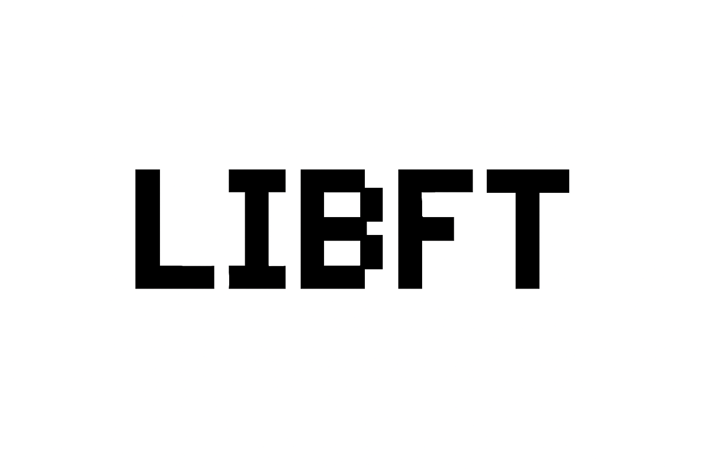

<h1 align="center">📚 Libft</h1>

<p align="center">
  <b>Custom C standard library – built from scratch at 42</b><br>
  <i>By <a href="https://github.com/CristianBitca">Cristian Bitca</a> · 42 London</i>
</p>

<p align="center">
  
</p>

<p align="center">
  
  
  
  
</p>

---

## 🧩 Overview

**Libft** is a personal C library re-implementing standard library functions and extending them with custom utilities for strings, memory, linked lists, and file I/O.  
It is the foundation of all future **42 London** projects and a great exercise in low-level programming.

This library also **directly includes and merges the code** from the next major 42 projects:

- 🔗 <a href="https://github.com/CristianBitca/ft_printf">ft_printf</a> – custom implementation of `printf`
- 🔗 <a href="https://github.com/CristianBitca/get_next_line">get_next_line</a> – function to read a file line by line

These projects are **not submodules** – their source code is merged into Libft and compiled as a single static library.

---

## 🗂️ Project Structure

```
libft/
├── include/
│   └── libft.h
│
├── srcs/
│   ├── [Character Functions]
│   ├── [String Functions]
│   ├── [Memory Functions]
│   ├── [Conversion Functions]
│   ├── [Output Functions]
│   ├── [Linked List Functions]
│   ├── [Utility Functions]
│   │   ├── ft_printf/
│   │   └── get_next_line/
│
└── Makefile
```

---

## ⚙️ Makefile

The Makefile automates compilation and creation of the static library **libft.a**.

| Command | Description |
|----------|-------------|
| `make` | Compiles all `.c` files and creates `libft.a` |
| `make clean` | Deletes object files |
| `make fclean` | Deletes object files and the library |
| `make re` | Rebuilds everything from scratch |

---

## 🧩 Function Breakdown

### 🅰️ Character Functions
`ft_isalpha` · `ft_isdigit` · `ft_isalnum` · `ft_isascii` · `ft_isprint` · `ft_toupper` · `ft_tolower`

### 🔤 String Functions
`ft_strlen` · `ft_strdup` · `ft_strcpy` · `ft_strlcpy` · `ft_strlcat` ·  
`ft_strchr` · `ft_strrchr` · `ft_strncmp` · `ft_strnstr` · `ft_strjoin` ·  
`ft_strtrim` · `ft_substr` · `ft_split` · `ft_strmapi` · `ft_striteri`

### 💾 Memory Functions
`ft_memset` · `ft_bzero` · `ft_memcpy` · `ft_memmove` · `ft_memchr` · `ft_memcmp` · `ft_calloc`

### 🔢 Conversion Functions
`ft_atoi` · `ft_itoa` · `ft_utoa`

### 🖨️ Output Functions
`ft_putchar_fd` · `ft_putstr_fd` · `ft_putendl_fd` · `ft_putnbr_fd`

### 🪢 Linked List Functions
`ft_lstnew` · `ft_lstadd_front` · `ft_lstadd_back` · `ft_lstsize` ·  
`ft_lstlast` · `ft_lstdelone` · `ft_lstclear` · `ft_lstiter` · `ft_lstmap`

### ⚙️ Utility Functions
`ft_printf` · `ft_get_next_line`

---

## 🧠 Key Features

✅ 100% written in **C**  
✅ Compliant with **Norminette**  
✅ Includes **bonus** linked list functions  
✅ Includes 🔗 <a href="https://github.com/CristianBitca/ft_printf">ft_printf</a> and 🔗 <a href="https://github.com/CristianBitca/get_next_line">get_next_line</a>  
✅ Modular structure with clear headers and Makefile automation  

---

## 🚀 How to Use Libft in Your Project

### 1️⃣ Clone Libft

```bash
git clone https://github.com/bitcacristi/libft.git
```

### 2️⃣ Build the library

```bash
cd libft
make
```

### 3️⃣ Include headers

```c
#include "libft.h"
```

### 4️⃣ Compile with Libft

```bash
gcc main.c -L. -lft -Iinclude && ./a.out
```

####  Or in your Makefile:

```makefile
LIBFT = libft/libft.a

$(NAME): $(OBJS)
	make -C libft
	$(CC) $(CFLAGS) $(OBJS) $(LIBFT) -o $(NAME)
```

### 🧪 Example Usage

```c
#include "libft.h"
#include <stdio.h>

int main(void)
{
    char *s = ft_strdup("Hello Libft!");
    ft_printf("%s\n", s);
    free(s);
    return 0;
}
```

Output:
```
Hello Libft!
```

---

## 🧰 Typical Workflow

```bash
make         # Compile the library
make clean   # Clean object files
make fclean  # Remove library and objects
make re      # Rebuild everything
```

---

## 👤 Author

**Cristian Bitca**  
📍 42 London  
💻 GitHub: [@CristianBitca](https://github.com/CristianBitca)

---

<p align="center">
  <i>“Code is like humor — when you have to explain it, it’s bad.”</i><br>
  🧠 Crafted with discipline, built for excellence.
</p>
